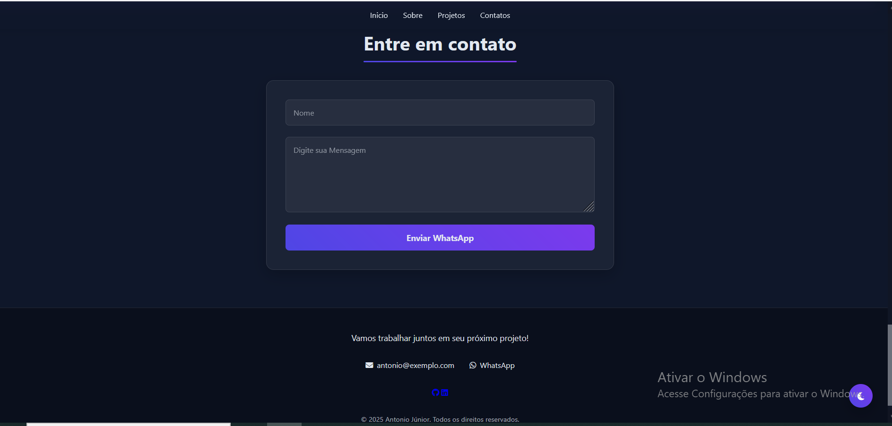

# 🌐 Portfólio Pessoal – Antonio Júnior

---

## 📌 Descrição
Este é o **meu projeto mais importante até o momento**: um portfólio pessoal moderno e responsivo, desenvolvido para apresentar minhas habilidades, experiências e projetos de forma profissional e interativa.  

O site conta com recursos avançados como:  
- Alternância entre **tema claro/escuro**  
- **Favicon personalizado** no navegador  
- **Barra de progresso** de scroll  
- **Layout em grid** para melhor organização das seções  
- **Overline** para destaque de títulos e menus  
- **Animações suaves** com IntersectionObserver  
- **Integração com WhatsApp** para contato direto  
- Layout **100% responsivo** para dispositivos móveis, tablets e desktops  

Criado utilizando **HTML, CSS e JavaScript**, com foco em usabilidade, performance e experiência do usuário.

---

## 🚀 Tecnologias Utilizadas
- **HTML5** – Estruturação do conteúdo  
- **CSS3** – Estilização, grid layout e efeitos visuais  
- **JavaScript (ES6+)** – Interatividade e funcionalidades dinâmicas  
- **LocalStorage** – Persistência do tema claro/escuro  
- **Font Awesome** – Ícones personalizados  
- **WhatsApp API** – Integração direta para envio de mensagens  
- **Favicon** – Ícone exclusivo na aba do navegador  

---

## 📂 Estrutura do Projeto
- 📁 Portfólio
- ┣ 📂 img # Imagens e capturas do projeto
- ┣ 📜 index.html # Estrutura principal
- ┣ 📜 style.css # Estilos e layout
- ┣ 📜 script.js # Funcionalidades JS
- ┗ 📜 README.md # Documentação do projeto

# 📸 Demonstração por Seções

### 🏠 **Home**
  
Tela inicial com boas-vindas, **foto de perfil** e chamada principal.  
- Destaque visual com **overline** nos títulos.  
- Layout em **grid** para melhor organização.  
- Botão de acesso rápido para contato.  

---
### 👨‍💻 **Sobre Mim**
  
Seção dedicada a minha trajetória e objetivos.  
- Breve descrição pessoal e profissional.  
- Lista de **habilidades técnicas** organizadas em grid.  
- Design responsivo adaptado para qualquer tela.  

---

### 📂 **Projetos**
  
Exibição dos principais trabalhos desenvolvidos.  
- Cada projeto possui **imagem de capa**, título e descrição.  
- Uso de **grid layout** para exibir os cards de forma organizada.  
- Projetos destacados: Website UNES, Anna Bella, TechBlog, Chatbot WhatsApp e este portfólio.  

---

### 📞 **Contato**
  
Área final do portfólio para comunicação direta.  
- **Formulário integrado com WhatsApp**.  
- Links diretos para **GitHub**, **LinkedIn** e **Currículo**.  
- Ícones personalizados para melhor experiência.  

---

## 🧩 Funcionalidades
✅ Alternância de tema (claro/escuro)  
✅ Barra de progresso ao rolar a página  
✅ **Favicon** exclusivo do portfólio  
✅ **Overline** para destaque dos menus e títulos  
✅ **Layout em grid** em todas as seções  
✅ Animações suaves de entrada dos elementos  
✅ Integração com WhatsApp via formulário  
✅ Layout responsivo (mobile-first)  
✅ Navegação simples e intuitiva  

---

## 🎯 Objetivo
Este projeto foi criado para **consolidar meus conhecimentos em front-end** e servir como **vitrine profissional**, facilitando o acesso a informações sobre mim e meus projetos.

## 🤝 Mensagem aos Recrutadores
Obrigado por visitar meu portfólio!  
Estou **motivado a aplicar meus conhecimentos e crescer junto com sua equipe**.  
Se você busca um profissional dedicado, criativo e em constante aprendizado, será um prazer trabalharmos juntos.  

📩 Entre em contato comigo, vamos conversar! 🚀  

---
